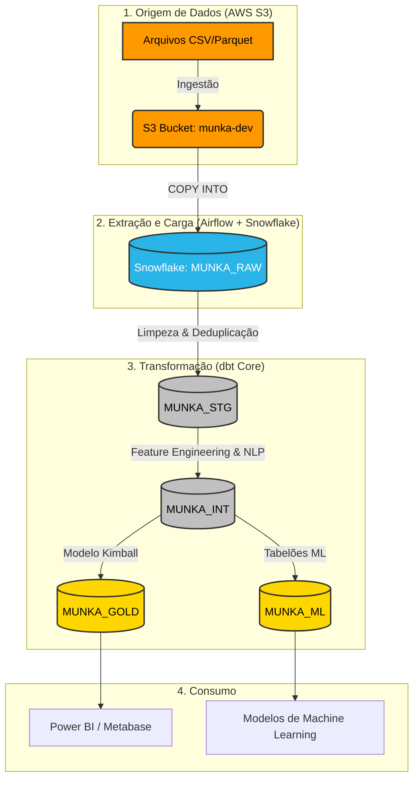

# 📚 Documentação Oficial: Data Warehouse MUNKA

Este documento descreve detalhadamente a arquitetura de dados, o fluxo do pipeline (ELT) e as decisões de engenharia aplicadas no projeto **MUNKA Data Warehouse**.

---

## 1. Visão Geral da Arquitetura
O projeto implementa uma plataforma analítica na nuvem utilizando os melhores princípios da Engenharia de Dados Moderna. A espinha dorsal do projeto é a **Arquitetura Medallion** (Bronze, Prata e Ouro), onde os dados fluem da AWS S3 para o Snowflake e são orquestrados pelo Apache Airflow e modelados usando o dbt (Data Build Tool).

### Diagrama de Arquitetura e Fluxo (Pipeline)

---

## 2. Fluxo do Pipeline e Orquestração (Airflow)
A orquestração do projeto é centralizada no Apache Airflow executando via Docker. A malha de dados é construída em 4 DAGs sequenciais e dependentes:

### `passo1_munka_dbt_create_raw_tables`
- **Função:** Prepara o Data Warehouse.
- **Ação:** Aciona macros do dbt para rodar o DDL inicial (`CREATE TABLE`), construindo a base vazia das 49 tabelas do banco relacional legado na camada `MUNKA_RAW`.

### `passo2_s3_to_snowflake_munka_raw`
- **Função:** Ingestão de Dados (EL).
- **Ação:** Utiliza o `SnowflakeOperator` do Airflow para executar 49 comandos paralelos de `COPY INTO`. Os comandos acessam o Bucket S3 da AWS usando credenciais vinculadas a conexão `aws_default` no Airflow e carregam milhares de linhas em segundos.

### `passo3_munka_dbt_create_stg`
- **Função:** Camada Silver (STAGING).
- **Ação:** Aciona o `dbt run --select staging`. O dbt aplica funções rigorosas de limpeza, utilizando `QUALIFY ROW_NUMBER()` para remover dados duplicados com base em IDs e timestamps, padronizando os nomes das tabelas e colunas.

### `passo4_munka_dbt_run_marts`
- **Função:** Camada Gold e Machine Learning.
- **Ação:** Dispara `dbt run --select intermediate marts`. Este passo reconstrói o Modelo Estrela (Fatos e Dimensões) a partir do zero a cada execução, gerando agregações analíticas e extraindo features de Inteligência Artificial.

---

## 3. Estrutura do dbt e Modelagem

Todo o processamento analítico (`T` do modelo `ELT`) reside dentro de `src/dbt/models`. O projeto gerencia impressionantes **90 modelos de dados**, organizados assim:

### 3.1 Camada Staging (`models/staging`)
As views de staging são reflexos espelhados e higienizados da origem. Não contêm lógicas de negócio ou métricas, apenas *casting* (tipagem) e deduplicação de chaves.

### 3.2 Camada Intermediate (`models/intermediate`)
Aqui ocorrem transformações complexas que não devem ficar nas Fatos nem na Staging.
**Destaque:** O modelo `int_tarefa_evidencias_features.sql` atua como um motor de Processamento de Linguagem Natural (NLP) usando as expressões RegEx do Snowflake:
- Detecta a "Tech Stack" lendo menções a (Python, SQL, React) dentro de códigos-fonte nos tickets de manutenção.
- Identifica "Bugs Escondidos" (Tracebacks, Exceções) e a "Conformidade" por Pull Requests (GitHub/GitLab).

### 3.3 Camada Gold (`models/marts/gold`)
Modelo Dimensional (Kimball) para consumo por ferramentas de Business Intelligence:
- **Chaves Artificiais**: Todas as tabelas usam **Surrogate Keys (SK)** geradas via `HASH('TABELA', ID_NATURAL)` para garantir rastreabilidade e permitir *Slowly Changing Dimensions (SCD)* no futuro.
- **38 Tabelas Automatizadas**: Todas as dimensões legadas (ex: `dim_projeto`, `dim_sprint`, `dim_usuario`) e fatos numéricas (`fato_tarefa_evidencia`, `fct_fatura`) foram convertidas de grandes monólitos SQL para pequenos módulos dbt eficientes.

### 3.4 Camada ML (`models/marts/ml`)
- **`ml_tarefa_features`**: Uma tabela ampla (*Wide Table*) desnormalizada desenhada unicamente para Cientistas de Dados. Ela pré-cruza os dados de horas/esforço com todo o contexto da tarefa, regras, pontuações de evidências e stack tecnológica, evitando que os Cientistas precisem fazer `JOINs` massivos em Pandas.

---

## 4. Governança e Qualidade (Data Quality)
O projeto automatizou testes de qualidade (`Data Quality`) diretamente pelo dbt sem depender de scripts externos:
- **`schema.yml` Automatizado:** Na pasta `gold`, existe um arquivo estruturado que aplica regras automáticas em todas as 38 dimensões e fatos.
- **Testes Rodados:** A cada carga, executa-se testes de `unique` (unicidade) e `not_null` (não-nulo) para garantir que a geração de Surrogate Keys (HASH) nunca sofra de colisões ou corrupção de tabelas, assegurando a confiabilidade do BI e dos modelos de Inteligência Artificial.

---

## 5. Repositório Limpo (Clean Code)
O projeto passou por um extenso refactoring. Todas as 4.300 linhas de código legado do banco de dados relacional anterior (como DDLs monolíticos) foram migrados para a árvore dbt, mantendo a estrutura enxuta, auto-documentada (dbt docs) e totalmente integrada aos processos de CI/CD (Continuous Integration).
