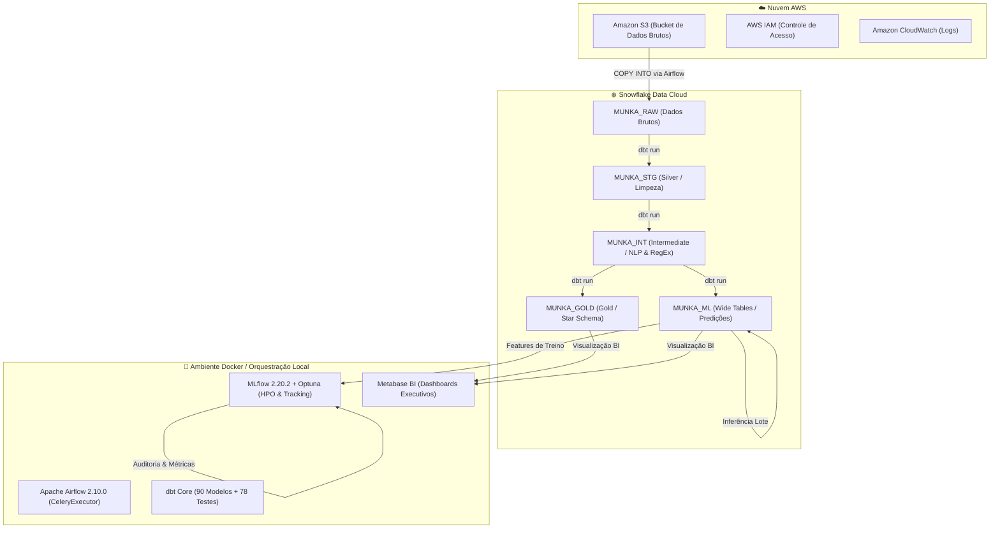
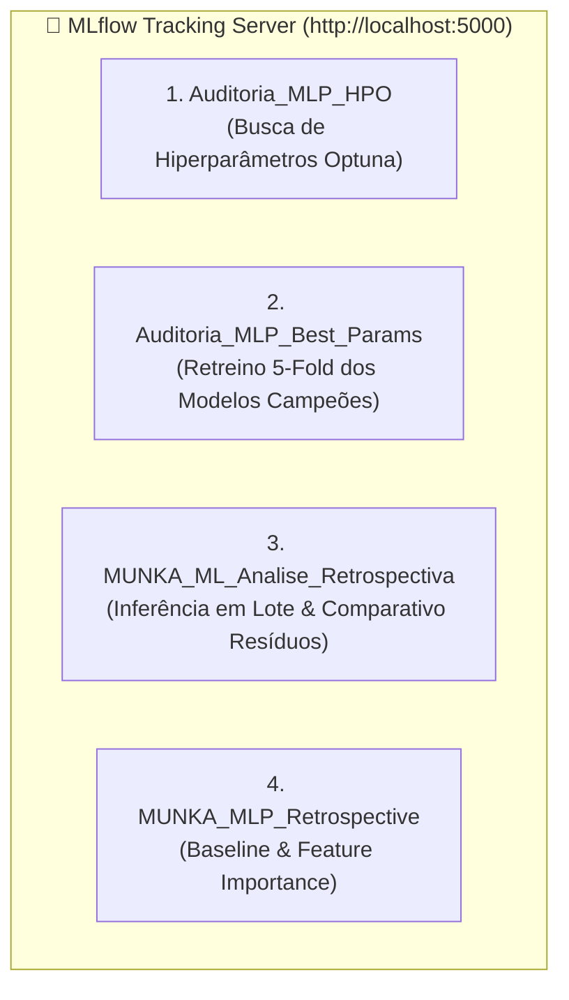

# Engenharia de Dados com Apache Airflow, Snowflake e dbt (Projeto MUNKA)

Repositório do projeto **"Engenharia de Dados com Apache Airflow, Snowflake e dbt" (IFG)**, focado na construção de um Data Warehouse Moderno com Arquitetura Medallion (Bronze/Raw, Silver/Staging, Gold/Marts) para suportar Business Intelligence e Machine Learning / MLOps.

---

## 🏛️ Arquitetura da Solução

A arquitetura do projeto foi desenhada para extrair dados brutos da nuvem AWS, limpá-los e transformá-los em estruturas analíticas dimensionais (Star Schema) e tabelões desnormalizados (Wide Tables para ML):



* **RAW (`MUNKA_RAW`)**: Ingestão bruta de 39 tabelas legadas do Jira/Munka via `COPY INTO` a partir do AWS S3.
* **STAGING (`MUNKA_STG`)**: Limpeza, tipagem, padronização e deduplicação (`QUALIFY ROW_NUMBER()`).
* **INTERMEDIATE (`MUNKA_INT`)**: Engenharia de features textuais com Expressões Regulares (`REGEXP`) no Snowflake (contagem de imagens, links, commits, código, SQL e tamanho de texto).
* **GOLD/MARTS (`MUNKA_GOLD` e `MUNKA_ML`)**: Fatos e Dimensões no modelo Star Schema e tabelas desnormalizadas (Wide Tables) prontas para modelagem de Machine Learning e BI.

---

## ⏱️ Orquestração (DAGs no Airflow)

O pipeline de dados e MLOps é automatizado ponta a ponta no Apache Airflow, composto por uma DAG Master e 7 passos modulares:

```mermaid
graph LR
    Master[dag_munka_full_pipeline] --> P1[passo1_munka_dbt_create_raw_tables]
    P1 --> P2[passo2_s3_to_snowflake_munka_raw]
    P2 --> P3[passo3_munka_dbt_create_stg]
    P3 --> P4[passo4_munka_dbt_run_marts]
    P4 --> P5[passo5_ml_hpo_e_retreinamento]
    P5 --> P6[passo6_batch_inference]
    P6 --> P7[passo7_ml_carga_analise_retrospectiva]
```



* **`dag_munka_full_pipeline`**: DAG Master orquestradora que dispara e monitora sequencialmente todos os passos do pipeline.
1. **`passo1_munka_dbt_create_raw_tables`**: Provisionamento do DDL inicial e tabelas na camada RAW (`MUNKA_RAW`).
2. **`passo2_s3_to_snowflake_munka_raw`**: Ingestão paralela de dados brutos do AWS S3 para o Snowflake via `COPY INTO`.
3. **`passo3_munka_dbt_create_stg`**: Executa a camada Silver/Staging no dbt (`dbt run --select staging`) com limpeza e deduplicação.
4. **`passo4_munka_dbt_run_marts`**: Constrói as camadas Gold e ML no dbt (`dbt run --select intermediate marts`) e executa a suíte de 78 testes de integridade (`dbt test`).
5. **`passo5_ml_hpo_e_retreinamento`**: Otimização automática de hiperparâmetros via Optuna (HPO), retreinamento com validação cruzada 5-Fold e registro no MLflow (`Auditoria_MLP_HPO` e `Auditoria_MLP_Best_Params`).
6. **`passo6_batch_inference`**: Inferência e Análise Retrospectiva em lote (`batch_inference.py`), calculando resíduos/métricas e registrando no experimento `MUNKA_ML_Analise_Retrospectiva` do MLflow.
7. **`passo7_ml_carga_analise_retrospectiva`**: Sincronização do CSV de auditoria para o diretório de seeds (`src/dbt/seeds/analise_retrospectiva.csv`), carga via `dbt seed` e materialização da mart `MUNKA_ML.ML_ANALISE_RETROSPECTIVA` no Snowflake.

---

## 🛠️ Tecnologias e Componentes Utilizados

* **Snowflake Data Cloud**: Data Warehouse elástico e escalável na nuvem com autenticação segura via Par de Chaves RSA (PKCS#8).
* **Apache Airflow 2.10.0**: Orquestrador com CeleryExecutor, Workers distribuídos e DAGs independentes e idempotentes.
* **dbt Core 1.7.x**: Framework de modelagem, versionamento, documentação e testes de dados.
* **MLflow 2.20.2**: Plataforma central de rastreamento científico de experimentos, hiperparâmetros, métricas e artefatos de ML.
* **Optuna**: Framework de otimização bayesiana/estocástica de hiperparâmetros (HPO).
* **Metabase BI**: Ferramenta de visualização executiva conectada nativamente ao Snowflake via driver JDBC com autenticação RSA.
* **Docker & Docker Compose**: Conteinerização de toda a infraestrutura local (Airflow, Postgres, Redis, Metabase).
* **AWS S3 & CloudFormation**: Armazenamento de dados brutos e provisionamento de infraestrutura como código (IaC).

---

## 📋 Requisitos Prévios

| Requisito | Versão / Detalhe | Obrigatório |
|-----------|-----------------|-------------|
| **Docker Desktop** | `>= 24.x` (com Docker Compose v2) | ✅ Sim |
| **Python** | `3.10` a `3.13` | ✅ Sim |
| **Conta Snowflake** | Standard ou superior | ✅ Sim |
| **Conta AWS** | Com acesso IAM e S3 | ✅ Sim |
| **Git** | `>= 2.x` | ✅ Sim |

---

## 🚀 Como Executar o Projeto

### 1. Clonar o Repositório e Configurar Variáveis
```bash
git clone https://github.com/ivaniojr/dbt-snowflake-airflow-main.git
cd dbt-snowflake-airflow-main

# Copiar arquivo de credenciais
cp credentials_template.env .env
```

### 2. Iniciar a Stack Docker
```bash
cd airflow
docker compose up -d --build
```

### 3. Acessar as Interfaces
* **Apache Airflow:** [`http://localhost:8081`](http://localhost:8081) — Usuário: `airflow` / Senha: `airflow`
* **MLflow UI:** [`http://localhost:5000`](http://localhost:5000)
* **Metabase BI:** [`http://localhost:3000`](http://localhost:3000)

### 4. Executar o Pipeline Completo
No Airflow, ative e dispare a DAG: **`dag_munka_full_pipeline`**.

---

## 🧪 Machine Learning — MLflow, HPO e Análise Retrospectiva

### Modelos Desenvolvidos e Comparados
1. **NumPy MLP (Matemático):** Implementação pura em NumPy com cálculo manual de Forward/Backpropagation e SGD, comprovando domínio profundo dos fundamentos matemáticos.
2. **Scikit-Learn MLP (Campeão de Produção):** Rede Neural MLPRegressor otimizada em Cython com otimizador Adam, regularização dinâmica e topologia adaptativa.
3. **Scikit-Learn Restrito (Controle Científico):** Grupo de controle *apples-to-apples* com a mesma topologia e limitações da versão NumPy.

### Experimentos no MLflow



Para iniciar a interface visual do MLflow localmente:
```bash
mlflow ui --backend-store-uri sqlite:///src/ml/mlflow.db --port 5000
```

### Scripts Disponíveis no Diretório `src/ml/`

| Script | Descrição |
|---|---|
| [`src/ml/train.py`](src/ml/train.py) | Treinamento Baseline comparando NumPy vs Sklearn (5-Fold CV + Holdout) |
| [`src/ml/hpo.py`](src/ml/hpo.py) | Otimização Automática de Hiperparâmetros via Optuna (Passo 5) |
| [`src/ml/train_best.py`](src/ml/train_best.py) | Retreinamento com os melhores parâmetros e exportação dos modelos (Passo 5) |
| [`src/ml/batch_inference.py`](src/ml/batch_inference.py) | Análise Retrospectiva em lote sobre tarefas executadas (Passo 6) |
| [`src/ml/load_analise_retrospectiva.py`](src/ml/load_analise_retrospectiva.py) | Carga direta e autônoma do CSV de auditoria no Snowflake via Python |
| [`src/ml/export_evaluation_dataset.py`](src/ml/export_evaluation_dataset.py) | Exportação de dataset Holdout isolado para auditoria |

---

## 🏆 Resultados Oficiais de Homologação

### 1. Benchmark de Otimização e Retreinamento (5-Fold CV):
| Modelo | Arquitetura / Topologia | $MSE$ Validação | $R^2$ Score | Status Final |
|---|---|---|---|---|
| **MLP Scikit-Learn (Campeão)** | 2 camadas `(64, 128)`, $lr=0.0033$, $\alpha=0.000025$ | **5.46** | **0.75 (75%)** | 🏆 **Produção** |
| **MLP Sklearn Restrito** | 2 camadas `(64, 32)`, $lr=0.0027$ | 5.49 | 0.74 (74%) | 🧪 Controle |
| **MLP NumPy (Puro)** | 2 camadas `(16, 32)`, $lr=0.0375$ | 6.90 | 0.68 (68%) | 🥈 Matemático |
| **Baseline Linear** | Regressão Linear Simples | 345.12 | 0.58 (58%) | Baseline |

### 2. Análise Retrospectiva em Lote (`analise_retrospectiva_metrics.json`):
| Métrica | Scikit-Learn MLP | NumPy MLP |
|---|---|---|
| **Erro Médio Absoluto (MAE)** | **0.7475 h** | 0.9143 h |
| **Raiz do Erro Quadrático Médio (RMSE)** | **1.4937 h** | 1.5990 h |
| **Erro Quadrático Médio (MSE)** | **2.2312** | 2.5568 |
| **Coeficiente de Determinação ($R^2$)** | **0.7387 (73.9%)** | 0.7005 (70.1%) |

---

## 📊 Metabase — Visualização e BI

O Metabase consome diretamente as tabelas dimensionais Gold e a mart de predições de ML.

### Conexão com o Snowflake:
* **Database type:** `Snowflake`
* **Account:** `sfedu02-gfb24387`
* **Username:** `DRAGON`
* **Authentication:** Chave Privada RSA (`/metabase-data/rsa_key.p8`)
* **Warehouse:** `DRAGON_WH`
* **Database:** `DRAGON_DB`
* **Schemas:** `MUNKA_GOLD, MUNKA_ML`
* **Role:** `TRAINING_ROLE`
* **Additional JDBC Options:** `disablePlatformDetection=true`

---

## 📚 Documentação Técnica Adicional

* 📕 **[RelatorioProjetov15.pdf](RelatorioProjetov15.pdf)**: Relatório executivo e acadêmico final consolidado do Projeto MUNKA (formato PDF oficial).
* 📖 **[ROTEIRO_IMPLANTACAO.md](ROTEIRO_IMPLANTACAO.md)**: Guia completo de implantação, infraestrutura AWS CloudFormation, DDLs Snowflake, comandos passo a passo e troubleshooting.
* 📄 **[RELATORIO_TECNICO_PROJETO_MUNKA.md](RELATORIO_TECNICO_PROJETO_MUNKA.md)**: Relatório técnico detalhado com fundamentação teórica, modelagem dimensional e arquitetura MLOps.

---

## 👥 Integrantes do Grupo (IFG)

| Nome do Integrante | Papel no Projeto | E-mail / Contato |
|---|---|---|
| **Ivanio Junior** | Engenharia de Dados & Pipeline Airflow | ivaniojr@users.noreply.github.com |
| **Robson Silva** | Arquitetura Snowflake & Metabase BI | robson.silva.cr@gmail.com |
