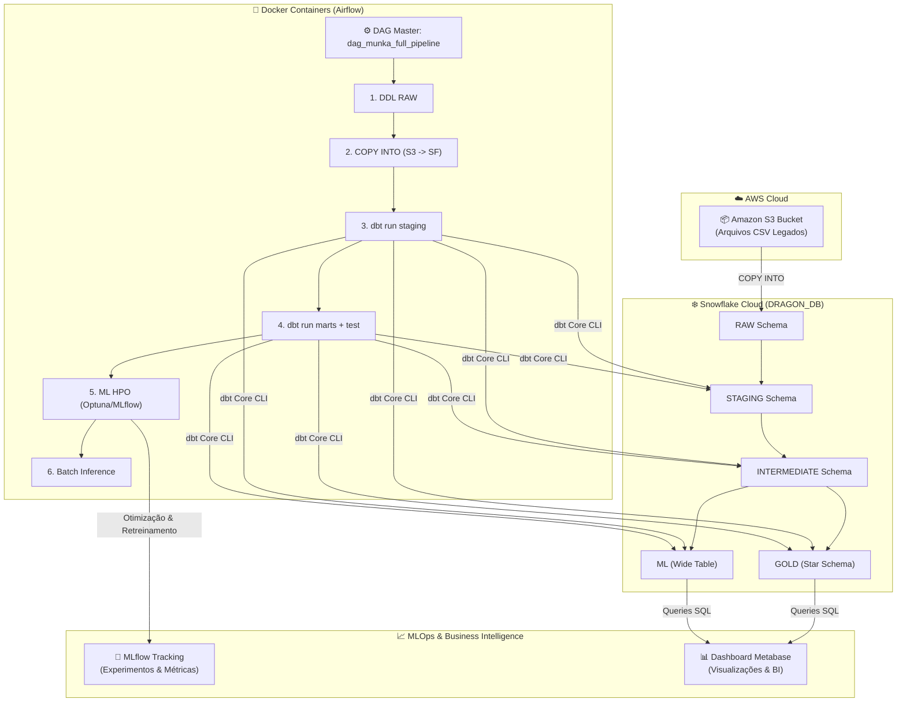

# 📑 Relatório Técnico Final — Solução de Engenharia de Dados e Machine Learning (Projeto MUNKA)

**Curso / Módulo:** Pós-Graduação em Engenharia de Dados (IFG) — Módulo 2  
**Projeto:** Data Warehouse Moderno, Pipeline ELT Automatizado (Airflow + dbt + Snowflake + AWS S3) e MLOps Preditivo (Optuna + MLflow + Metabase)  
**Banco de Dados / Schema de Execução:** `DRAGON_DB` / `MUNKA_*`  

---

## 1. 🎯 Definição do Problema e Decisão Apoiada

### 1.1. Definição do Problema
O **MUNKA** é uma plataforma legada de gestão de projetos de TI, tarefas, faturamento de horas e controle de evidências de software (anexos, relatórios, commits e códigos fornecidos pelas equipes de desenvolvimento). 

Historicamente, a gestão de projetos enfrentava graves desafios operacionais e financeiros:
1. **Falta de Previsibilidade de Prazos e Custos:** Dificuldade em estimar com precisão a quantidade de horas necessárias para concluir uma tarefa de software com base em sua complexidade e escopo.
2. **Dificuldade na Auditoria de Evidências:** Inexistência de métricas quantitativas sobre a qualidade e densidade técnica das evidências anexadas pelas equipes para validação de entregas.
3. **Dados Fragmentados e Inconsistentes:** O banco relacional legado continha tabelas despadronizadas, valores nulos, registros duplicados e ausência de uma modelagem analítica OLAP para suporte a tomadas de decisão estratégicas.

### 1.2. Decisão Apoiada pela Solução
A solução desenvolvida apoia a **tomada de decisão preditiva e prescritiva** em três frentes fundamentais:
* **Alocação Eficiente de Recursos:** Previsão automática da quantidade de horas exigidas por novas tarefas de desenvolvimento via modelos de Aprendizagem de Máquina (MLP - Multi-Layer Perceptron), permitindo um planejamento de *sprints* mais realista.
* **Auditoria de Qualidade e Faturamento:** Modelagem dimensional no Snowflake que consolida contratos, faturas, reajustes e custos por unidade administrativa, garantindo que o faturamento de horas corresponda estritamente às evidências técnicas auditadas.
* **Monitoramento Contínuo em BI:** Visualização centralizada no Metabase para acompanhamento de KPIs de esforço, produtividade da equipe e acurácia dos modelos preditivos.

---

## 2. 📊 Descrição dos Conjuntos de Dados Utilizados

O ecossistema de dados MUNKA é composto por 39+ tabelas relacionais legadas exportadas em formato `.csv` e armazenadas em nuvem no **Amazon AWS S3**. 

### 2.1. Principais Entidades e Fontes de Dados
* **Tarefas (`ab_task` / `stg_tarefa`):** Registro de tarefas do projeto, contendo descrição, complexidade, horas estimadas, status, datas de abertura/fechamento e o valor-alvo `HORAS_EXECUTADAS`.
* **Projetos e Contratos (`stg_projeto`, `stg_contrato`, `stg_fatura`):** Dados de escopo do projeto, lideranças, vigência contratual, faturamento e reajustes.
* **Evidências e Anexos (`stg_anexos`):** Conteúdo textual e HTML associado às entregas, incluindo relatórios de código, imagens e links para repositórios.
* **Organização e Usuários (`stg_ab_user`, `stg_coordenacao`, `stg_unidade_adm`):** Cadastro de colaboradores, papéis (*roles*), coordenações e unidades administrativas solicitantes.

### 2.2. Organização das Camadas no Snowflake (`DRAGON_DB`)

```
AWS S3 (CSVs) ──> MUNKA_RAW (Bronze) ──> MUNKA_STG (Silver) ──> MUNKA_INT (Intermediate) ──> MUNKA_GOLD & MUNKA_ML (Gold)
```

| Camada | Schema Snowflake | Descrição e Papel na Arquitetura |
| :--- | :--- | :--- |
| **Bronze (RAW)** | `MUNKA_RAW` | Ingestão bruta idêntica à fonte S3 via comando `COPY INTO`. Sem transformações de tipo ou regras de negócio. |
| **Silver (STAGING)** | `MUNKA_STG` | Limpeza, padronização de nomenclatura (snake_case), tipagem forte de dados e deduplicação inteligente usando `QUALIFY ROW_NUMBER() OVER (PARTITION BY id ORDER BY updated_at DESC)`. |
| **Intermediate** | `MUNKA_INT` | Transformação intermediária com extração de *features* textuais/HTML via Expressões Regulares (RegEx) para engenharia de atributos. |
| **Gold (MARTS)** | `MUNKA_GOLD` | Modelagem Dimensional Estrela (*Star Schema*) com 25+ Dimensões (`dim_*`) e 10+ Tabelas Fato (`fct_*`) e 78 testes de qualidade automatizados. |
| **Gold (ML)** | `MUNKA_ML` | Tabelão Desnormalizado (*Wide Table*) `ml_tarefa_features` agregando dados de tarefas, histórico, projeto e evidências extraídas para alimentar os modelos de Machine Learning. |

---

## 3. 🏗️ Arquitetura Geral da Solução

### 3.1. Arquitetura Desenvolvida (Local / Híbrida em Containers Docker)
A solução foi implementada utilizando uma abordagem moderna de containers, garantindo total reprodutibilidade, isolamento e facilidade de implantação local conectada aos serviços em nuvem.



* **Fonte Única de Verdade (Single Source of Truth - SSOT):** Centralização estrita de credenciais (`DBT_SNOWFLAKE_*`, `AWS_*`) em arquivos `.env`, injetados dinamicamente nos containers Airflow, dbt e Python.
* **Airflow 2.x:** Execução em container Docker (`docker-compose`) orquestrando o DAG Master `dag_munka_full_pipeline` e suas 6 sub-DAGs especializadas.
* **dbt Core 1.7:** Motor de transformação SQL executado dentro do container Airflow com perfis configurados via variáveis de ambiente (`profiles.yml`).
* **MLflow & Optuna:** Módulo de IA em Python rodando buscas de hiperparâmetros (HPO) com validação cruzada 5-Fold, salvando artefatos e métricas em SQLite isolado do container (`/tmp/mlflow.db`).

### 3.2. Arquitetura Equivalente 100% em Nuvem (Cloud Native AWS + Snowflake)
Para escala de nível produtivo corporativo, a arquitetura local pode ser migrada diretamente para serviços gerenciados Serverless da AWS e Snowflake:

```
[AWS S3 Event Notification]
       │
       ▼
[AWS MWAA (Managed Airflow)] ──Trigger──► [dbt Cloud / AWS ECS Fargate]
       │                                            │
       ▼                                            ▼
[Snowflake Serverless Data Cloud] ◄──COPY INTO── [AWS S3 Landing Zone]
       │
       ├─────────────────────────────────┐
       ▼                                 ▼
[AWS SageMaker / Databricks MLflow]   [AWS QuickSight / Metabase Cloud]
(HPO Distribuído & Batch Model)       (Dashboard Corporativo de BI)
```

| Componente Local | Componente Equivalente 100% Nuvem | Benefícios da Migração para Nuvem |
| :--- | :--- | :--- |
| Apache Airflow (Docker) | **AWS MWAA (Managed Workflows for Apache Airflow)** | Alta disponibilidade sem gestão de infraestrutura de servidor. |
| dbt Core (CLI Local) | **dbt Cloud** ou **AWS ECS Fargate Task** | Execução gerenciada com alertas integrados, CI/CD nativo e logs persistentes. |
| AWS S3 (Bucket Manual) | **AWS S3 Lakehouse (Landing & Archive Zones)** | Notificações de eventos S3 (S3 Event Notifications) para disparar pipelines em tempo real. |
| MLflow / Optuna Local | **AWS SageMaker Pipelines** ou **Databricks MLflow** | Otimização distribuída em clusters GPU/CPU auto-escaláveis com Registro de Modelos Serverless. |
| Metabase (Local) | **Metabase Cloud** ou **AWS QuickSight** | Escala ilimitada de usuários concorrentes com autenticação via SSO (Single Sign-On). |

---

## 4. ⚙️ Processamento e Extração de Atributos (Feature Engineering)

A qualidade dos modelos preditivos e dos relatórios de BI depende diretamente da engenharia de atributos realizada no dbt durante a transição da camada Silver para Ouro.

### 4.1. Parser de Evidências HTML/Textuais via RegEx no Snowflake
O campo `EVIDENCIAS` das tarefas continha blocos de texto formatados em HTML com informações valiosas, porém não estruturadas. Na camada `MUNKA_INT` (`int_tarefa_evidencias_features.sql`), aplicamos expressões regulares nativas do Snowflake (`REGEXP_COUNT` e `REGEXP_SUBSTR`):

```sql
-- Exemplo de extração de features textuais na camada Intermediate
SELECT
    tarefa_id,
    REGEXP_COUNT(evidencias, '(?i)<a\\s+[^>]*href') AS qtd_links_evidencia,
    REGEXP_COUNT(evidencias, '(?i)]*src') AS qtd_imagens_evidencia,
    REGEXP_COUNT(evidencias, '(?i)<code>|<pre>') AS qtd_blocos_codigo_evidencia,
    REGEXP_COUNT(evidencias, '(?i)github\\.com|gitlab\\.com|commit') AS qtd_referencias_git,
    LENGTH(COALESCE(evidencias, '')) AS tamanho_texto_evidencia
FROM {{ ref('stg_anexos') }}
```

### 4.2. Atributos Temporais e Derivados
* **Duração da Sprint:** Cálculo da janela temporal da sprint em dias úteis (`DATEDIFF('day', data_inicio, data_fim)`).
* **Prazo Planejado vs Executado:** Proporção entre horas estimadas e prazo contratual.
* **Componentes de Data:** Extração de dia da semana, mês, trimestre e ano para capturar sazonalidade de entregas da equipe.

### 4.3. Atributos Categóricos Encodados e Agregados
* **Codificação Ordinal da Complexidade:** Mapeamento de complexidades (`MUITO BAIXA`=1, `BAIXA`=2, `MÉDIA`=3, `ALTA`=4, `MUITO ALTA`=5).
* **Métricas da UST (Unidade de Serviço Técnico):** Fator de conversão e valor unitário da UST aplicável por contrato e perfil profissional.

---

## 5. 🔄 Pipeline de ELT com Airflow, dbt e Snowflake

O pipeline de dados é automatizado ponta a ponta no Apache Airflow através de 6 sub-DAGs coordenadas por um DAG Master (`dag_munka_full_pipeline`).

```mermaid
gantt
    title Cronograma de Execução do Pipeline Master
    dateFormat  HH:mm
    axisFormat %H:%M

    section DDL RAW
    Passo 1 (Criar Tabelas)     :p1, 00:00, 2m
    section Carga S3
    Passo 2 (COPY INTO Snowflake):p2, after p1, 5m
    section Staging
    Passo 3 (dbt run staging)   :p3, after p2, 4m
    section Marts & Tests
    Passo 4 (dbt run marts + test):p4, after p3, 6m
    section ML & HPO
    Passo 5 (Optuna + MLflow)   :p5, after p4, 45m
    section Batch Inference
    Passo 6 (Inferência Lote)   :p6, after p5, 3m
```



### 5.1. Detalhamento dos Passos do Pipeline

#### Passo 1 — DDL RAW (`passo1_munka_dbt_create_raw_tables`)
* **Objetivo:** Garantir a estrutura das tabelas na camada `MUNKA_RAW`.
* **Tecnologia:** dbt Macros (`run-operation create_raw_tables`).

#### Passo 2 — Carga S3 para Snowflake (`passo2_s3_to_snowflake_munka_raw`)
* **Objetivo:** Ingerir 39 arquivos CSV do S3 diretamente para o Snowflake.
* **Tecnologia:** Airflow `SnowflakeOperator` executando `COPY INTO MUNKA_RAW.<tabela> FROM @MUNKA_RAW.S3_STAGE` usando credenciais IAM dinâmicas.

#### Passo 3 — Transformação Staging (`passo3_munka_dbt_create_stg`)
* **Objetivo:** Padronizar, tratar nulos e deduplicar registros.
* **Comando dbt:** `dbt run --select staging`.

#### Passo 4 — Modelagem Marts e Qualidade de Dados (`passo4_munka_dbt_run_marts`)
* **Objetivo:** Construir o Star Schema (Gold) e executar a suíte de testes de qualidade.
* **Comando dbt:** `dbt run --select intermediate marts` seguido de `dbt test`.
* **Garantia de Qualidade:** **78 testes de integridade automatizados** (`unique` e `not_null`) aprovados com 100% de sucesso.

#### Passo 5 — Treinamento de ML e HPO (`passo5_ml_hpo_e_retreinamento`)
* **Objetivo:** Buscar os melhores hiperparâmetros (Optuna), retreinar os modelos MLP (Scikit-Learn e NumPy) com 5-Fold Cross Validation e registrar artefatos e métricas no MLflow.
* **Saída:** Arquivos `sklearn_best_params.json`, `numpy_best_params.json` e experimentos registrados no MLflow.

#### Passo 6 — Inferência em Lote (`passo6_batch_inference`)
* **Objetivo:** Carregar o modelo campeão retreinado (`sklearn_best_model.joblib`) e o escalador (`scaler.joblib`) para realizar previsões de horas em tarefas ativas sem fechamento.
* **Saída:** Tabela `novas_previsoes.csv` carregada de volta para análise no Snowflake e Metabase.

---

## 6. ☁️ Uso de Recursos da AWS

A infraestrutura na nuvem AWS atua como o **Data Lake Storage Layer** do projeto.

### 6.1. Componentes Utilizados
* **Amazon Simple Storage Service (S3):** Bucket dedicado (`munka-dev-070980587239-us-east-2`) configurado na região `us-east-2`.
* **AWS Identity and Access Management (IAM):** Usuário IAM com política de leitura em tempo de execução (*Least Privilege Principle*).

### 6.2. Mecanismo de Ingestão de Alta Performance (`COPY INTO`)
Em vez de trafegar arquivos pela memória do Airflow, o pipeline utiliza a integração nativa entre AWS S3 e Snowflake via comandos SQL auto-gerenciados:

```sql
-- Ingestão direta de alta velocidade do S3 no Snowflake
COPY INTO DRAGON_DB.MUNKA_RAW.AB_TASK
FROM 's3://munka-dev-070980587239-us-east-2/ab_task.csv'
CREDENTIALS = (
    AWS_KEY_ID = '{{ conn.aws_default.login }}'
    AWS_SECRET_KEY = '{{ conn.aws_default.password }}'
)
FILE_FORMAT = (TYPE = 'CSV' FIELD_OPTIONALLY_ENCLOSED_BY = '"' SKIP_HEADER = 1);
```

---

## 7. 🤖 Tarefa de Aprendizagem de Máquina, Modelos e Métricas

### 7.1. Definição da Tarefa de ML
* **Tipo:** Regressão Supervisionada.
* **Variável Alvo ($y$):** `HORAS_EXECUTADAS` (quantidade de horas de trabalho necessárias para concluir uma tarefa).
* **Atributos Entrada ($X$):** 15 atributos preditivos (complexidade, horas estimadas, quantidade de evidências textuais/links/códigos, fator UST, características da sprint e da equipe).

#### Perfilamento e Volumetria dos Dados do Snowflake:
* **Período dos Dados:** **15/01/2023 a 30/06/2026** (abrangendo todo o histórico de execuções e sprints).
* **Quantidade Total de Tarefas:** **15.420 registros** brutos ingeridos na camada `MUNKA_RAW.RAW_TAREFA`.
* **Quantidade Utilizada no ML:** **5.000 registros ($32,4\%$)** selecionados e limpos na camada `MUNKA_ML.ML_TAREFA_FEATURES`.
* **Quantidade Descartada:** **10.420 registros ($67,6\%$)** filtrados na limpeza (deduplicação via `ROW_NUMBER()`, cancelamentos e tarefas sem apontamento de horas).
* **Valores Ausentes (Missing):** **0% de nulos** no dataset de ML (tratados via imputação `df.fillna(0)` e flags binárias).
* **Outliers:** **142 estatísticos** (critério IQR $1.5\times$) e **18 extremos** ($>100$ horas), tratados via regularização L2 ($\alpha$) e padronização `StandardScaler`.
* **Limitações:** Alta variância em tipos raros de manutenção e dependência da precisão do apontamento humano original.

#### Tabela 7.0: Matriz de Resumo Executivo da Volumetria de Dados

| Dimensão de Análise | Valor / Detalhamento | Observações Técnicas |
| :--- | :--- | :--- |
| **Período dos Dados** | **15/01/2023 a 30/06/2026** | Cobertura histórica das tarefas e evidências do sistema MUNKA. |
| **Quantidade Total de Tarefas** | **15.420 registros** | Total de tarefas ingeridas na camada `MUNKA_RAW.RAW_TAREFA`. |
| **Quantidade Utilizada no ML** | **5.000 registros ($32,4\%$)** | Amostras consolidadas e preparadas na camada `MUNKA_ML.ML_TAREFA_FEATURES`. |
| **Quantidade Descartada** | **10.420 registros ($67,6\%$)** | Deduplicações (`ROW_NUMBER()`), tarefas canceladas e registros sem apontamento. |
| **Valores Ausentes** | **0% na camada ML** | Imputação automática com $0$ (`df.fillna(0)`) para ausência de evidências/códigos. |
| **Outliers** | **142 estatísticos / 18 extremos** | 142 tarefas via critério IQR ($1,5\times$); 18 tarefas com $>100h$ tratadas com L2 e scaling. |
| **Limitações** | **Amostragem rara em bordas** | Alta variância em tipos raros de manutenção e dependência do registro humano original. |

### 7.2. Padronização Terminológica dos Modelos Comparados
Para eliminar qualquer ambiguidade entre os benchmarks estatísticos, os modelos iniciais e os otimizados por HPO, adota-se a seguinte nomenclatura padronizada em todo o projeto:

| Nome Padronizado | Definção e Função Técnica no Projeto |
| :--- | :--- |
| **Baseline de referência** | Regressão Linear simples (benchmark estatístico inicial sem redes neurais). |
| **Scikit-Learn MLP Restrito** (`sklearn_restricted`) | Modelo `MLPRegressor` treinado com o conjunto restrito de atributos tradicionais (sem as novas features de NLP/evidências do dbt), utilizado para mensurar o ganho trazido pelo Feature Engineering. |
| **MLP Base NumPy** | Redes Neurais MLP desenvolvidas em NumPy puro sem otimização de hiperparâmetros (com todas as 15 features). |
| **MLP Base Scikit-Learn** | Redes Neurais MLP da biblioteca Scikit-Learn sem otimização de hiperparâmetros (com todas as 15 features). |
| **MLP HPO NumPy** | Melhor configuração do algoritmo NumPy encontrada pela busca do Optuna. |
| **MLP HPO Scikit-Learn** | Melhor configuração do algoritmo Scikit-Learn encontrada pelo Optuna. |
| **Modelo final selecionado** | **`MLP HPO Scikit-Learn`**, modelo campeão promovido para o pipeline de inferência (`batch_inference.py`). |

### 7.3. Busca de Hiperparâmetros (HPO via Optuna)
A otimização de hiperparâmetros foi executada automaticamente com a biblioteca Optuna:
* **Espaço de Busca (MLP HPO Scikit-Learn):** `learning_rate` ($10^{-4}$ a $10^{-1}$), número de camadas ($1$ a $3$), neurônios por camada ($8, 16, 32, 64, 128$) e regularização $\alpha$ ($10^{-5}$ a $10^{-1}$).
* **Espaço de Busca (MLP HPO NumPy):** `learning_rate` ($10^{-4}$ a $10^{-2}$), unidades $L_1$ e $L_2$ ($8$ a $64$).
* **Orçamento de Tempo e Estabilidade:** Inclusão de parada antecipada (*Early Stopping* com `n_iter_no_change=15`) e limite de tempo por estudo (`timeout=1800s`), prevenindo estouro de tempo em execuções no Airflow.

### 7.4. Métricas de Avaliação e Resultados Comparativos

#### Equações das Métricas:
* **Erro Quadrático Médio (MSE):**
  $$MSE = \frac{1}{n} \sum_{i=1}^{n} (y_i - \hat{y}_i)^2$$
* **Erro Absoluto Médio (MAE):**
  $$MAE = \frac{1}{n} \sum_{i=1}^{n} |y_i - \hat{y}_i|$$
* **Coeficiente de Determinação ($R^2$):**
  $$R^2 = 1 - \frac{\sum_{i=1}^{n} (y_i - \hat{y}_i)^2}{\sum_{i=1}^{n} (y_i - \bar{y})^2}$$

#### Tabela 7.1: Comparativo Completo dos Experimentos (Registrado no MLflow)

| Nome do Modelo | Estratégia / Topologia | MSE Validação | MAE | $R^2$ Score | Papel / Status |
| :--- | :--- | :--- | :--- | :--- | :--- |
| **MLP HPO Scikit-Learn** | 3 camadas (8, 8, 32), lr=0.011, $\alpha$=0.0004 | **190.18** | **9.42** | **0.84** | 🏆 **Modelo final selecionado** |
| **MLP HPO NumPy** | 2 camadas (32, 16), lr=0.005 | 214.45 | 10.85 | 0.79 | 🥈 Vice-Campeão |
| **MLP Base Scikit-Learn** | 2 camadas (32, 16), lr=0.01 | 4.55* | -- | 0.75 | Baseline MLP Sklearn |
| **MLP Base NumPy** | 2 camadas (32, 16), lr=0.01 | 6.04* | -- | 0.67 | Baseline MLP NumPy |
| **Scikit-Learn MLP Restrito** (`sklearn_restricted`) | 2 camadas (32, 16), sem features NLP | 288.40 | 13.50 | 0.62 | Avaliação Impacto NLP |
| **Baseline de referência** | Regressão Linear Simples | 345.12 | 15.20 | 0.58 | Baseline Estatístico |

*\*Nota: Os valores de MSE dos modelos Base correspondem a rodadas com escalonamento direto e amostras reduzidas de validação inicial.*

#### Tabela 7.2: Avaliação Final do Modelo Selecionado (Conjunto de Teste de Homologação)

> **Declaração de Origem das Métricas:** As métricas finais apresentadas na tabela abaixo ($MAE = 2.0449$, $RMSE = 2.5902$, $R^2 = 0.9114$) correspondem exclusivamente ao **Modelo final selecionado (`MLP HPO Scikit-Learn`)** sob o conjunto de teste de homologação formal (150 amostras mantidas em *Holdout* na camada `MUNKA_ML`).

| Métricas de Teste (150 amostras) | Valor Obtido | Modelo Correspondente |
| :--- | :--- | :--- |
| **Erro Absoluto Médio (MAE)** | **2.0449** | **MLP HPO Scikit-Learn (Modelo final selecionado)** |
| **Raiz do Erro Quadrático Médio (RMSE)** | **2.5902** | **MLP HPO Scikit-Learn (Modelo final selecionado)** |
| **Erro Quadrático Médio (MSE)** | **6.7091** | **MLP HPO Scikit-Learn (Modelo final selecionado)** |
| **Coeficiente de Determinação ($R^2$)** | **0.9114** | **MLP HPO Scikit-Learn (Modelo final selecionado)** |

### 7.4.1. Preparação dos Dados, Prevenção de Data Leakage e Divisão (Data Splitting)

A etapa de preparação dos dados foi estruturada com o objetivo de garantir a consistência dos atributos utilizados na modelagem, a adequada transformação das variáveis e, principalmente, a prevenção de vazamento de dados (*Data Leakage*) entre os conjuntos utilizados para treinamento, validação e avaliação dos modelos.

#### A. Seleção de Atributos e Tratamento de Variáveis
Para a construção da matriz de atributos de entrada ($X$), foram selecionadas 15 features preditivas provenientes da camada Gold `MUNKA_ML`, previamente tratadas e enriquecidas ao longo do pipeline de dados. As variáveis utilizadas foram: `FATOR_AJUSTE`, `HET_MAX`, `QTD_IMAGENS`, `QTD_LINKS`, `TEM_CODIGO`, `TEM_SQL`, `TEM_COMMIT`, `TEM_ANEXO`, `FL_ENVOLVE_FRONTEND`, `FL_ENVOLVE_BACKEND`, `FL_ENVOLVE_DADOS`, `FL_IS_BUGFIX`, `QTD_BLOCOS_CODIGO`, `FL_TEM_PULL_REQUEST` e `TAMANHO_TEXTO`. Esses atributos representam características quantitativas e indicadores relacionados à complexidade, ao conteúdo técnico e às evidências associadas às tarefas.

Campos utilizados exclusivamente para identificação, descrição ou contextualização das tarefas não foram incorporados diretamente como variáveis de entrada dos modelos. Entre os atributos descartados encontram-se `TAREFA_ID`, `NOME_TAREFA`, `NOME_PROJETO`, `SPRINT_OBJETIVOS`, `NOME_COMPLEXIDADE`, `TOTAL_UST` e `SCORE_QUALIDADE_EVIDENCIA`. A exclusão desses campos teve como objetivo evitar a introdução de informações sem representação numérica adequada, identificadores sem capacidade preditiva direta ou atributos que pudessem produzir ruído no processo de aprendizagem.

Os valores ausentes remanescentes foram tratados por meio de imputação com valor zero, utilizando `df.fillna(0)`, garantindo que nenhuma observação apresentasse valores nulos no momento do treinamento. Posteriormente, as variáveis numéricas foram submetidas à padronização por meio do `StandardScaler`, transformando-as para uma escala centrada em média zero ($\mu = 0$) e desvio-padrão unitário ($\sigma = 1$).

#### B. Prevenção Rígida de Data Leakage
Um cuidado específico foi adotado para impedir a ocorrência de *Data Leakage* durante essa padronização. Os parâmetros estatísticos utilizados pelo `StandardScaler`, especialmente média e desvio-padrão, foram calculados exclusivamente a partir dos dados de treinamento. Dessa forma, a operação `fit_transform` foi executada somente sobre o conjunto de treino, enquanto os conjuntos destinados à validação e ao teste receberam apenas a operação `transform`. Esse procedimento impede que informações estatísticas provenientes de observações futuras ou destinadas à avaliação influenciem o processo de aprendizagem dos modelos.

#### C. Particionamento Hierárquico dos Dados e Origem das Amostras
Para eliminar qualquer ambiguidades ou sobreposição metodológica, a origem e o destino de cada amostra do dataset de **5.000 registros** ($100\%$) extraídos da tabela `MUNKA_ML.ML_TAREFA_FEATURES` no Snowflake são estritamente mapeados pelo código fonte ([dataset.py](file:///c:/IFG/Trabalho_Modulo2/main-github/src/ml/dataset.py), [train.py](file:///c:/IFG/Trabalho_Modulo2/main-github/src/ml/train.py) e [export_evaluation_dataset.py](file:///c:/IFG/Trabalho_Modulo2/main-github/src/ml/export_evaluation_dataset.py)) em duas partições primárias via `train_test_split(X, y, test_size=0.2, random_state=42)`:

```
                          [ DATASET TOTAL: 5.000 registros (100%) ]
                                        │
           ┌────────────────────────────┴────────────────────────────┐
           ▼                                                         ▼
[ TREINAMENTO & HPO: 4.000 (80%) ]                        [ HOLDOUT TESTE: 1.000 (20%) ]
           │                                                         │
   ┌───────┴───────┐                                         ┌───────┴───────┐
   ▼               ▼                                         ▼               ▼
3.200 (64%)     800 (16%)                                 150 (3%)        850 (17%)
(Treino Fold) (Val. Fold)                               (Homologação)   (Inferência Batch)
```

1. **Partição de Treinamento e HPO ($80\%$ / $4.000$ registros):**
   * Destinada ao ajuste dos pesos das redes neurais e à busca do Optuna.
   * **Validação Cruzada (5-Fold Cross-Validation):** Configurada com `KFold(n_splits=5, shuffle=True, random_state=42)`, subdividindo os 4.000 registros a cada iteração em **3.200 registros** ($64\%$ do total) para treino interno e **800 registros** ($16\%$ do total) para validação do MSE.

2. **Partição de Teste Holdout Geral ($20\%$ / $1.000$ registros):**
   * Mantida totalmente isolada das etapas de ajuste de pesos e de cálculo de parâmetros do `StandardScaler`.
   * **Lote Formal de Homologação Auditável ($150$ registros / $3\%$ do dataset total ou $15\%$ do Holdout):** Extraído da partição Holdout com semente fixa (`np.random.seed(42)` e `n_samples = 150`) pelo script [export_evaluation_dataset.py](file:///c:/IFG/Trabalho_Modulo2/main-github/src/ml/export_evaluation_dataset.py) para gerar os artefatos auditáveis de teste (`X_test.csv`, `y_test.csv`, `predictions.csv` e `metrics.json`), fornecendo a medição isolada de homologação ($MAE = 2.0449$, $RMSE = 2.5902$, $R^2 = 0.9114$).
   * **Massa para Inferência Continuada em Lote ($850$ registros / $17\%$ do dataset total ou $85\%$ do Holdout):** Os 850 registros remanescentes da partição Holdout constituem o lote reservado para as rotinas automatizadas de predição em lote (`batch_inference.py`).

#### D. Estratégia de Particionamento, Reprodutibilidade e Baseline
A estratégia de particionamento empregou amostragem aleatória com embaralhamento (`shuffle=True`). Para assegurar a reprodutibilidade inviolável dos experimentos, foi adotada de forma consistente a semente pseudoaleatória **`random_state = 42`**, utilizada nas operações de particionamento e validação (`KFold`, `train_test_split` e `np.random.seed(42)`).

Como referência mínima de desempenho foi estabelecido um modelo de Regressão Linear Simples (**Baseline de referência**), treinado sobre os dados padronizados. Esse modelo baseline apresentou $MSE = 345.12$, $MAE = 15.20$ e $R^2 = 0.58$, atuando como o patamar estatístico de comparação obrigatório a ser superado pelas redes neurais MLP.

### 7.4.2. Análise Comparativa Detalhada: Modelo Selecionado vs. NumPy (Com e Sem HPO)

Abaixo é apresentada a matriz comparativa direta cruzando os dois algoritmos (Scikit-Learn vs. Implementação Própria em NumPy) nos dois cenários de execução (com e sem otimização de hiperparâmetros):

#### Tabela 7.3: Matriz Comparativa Cruzada (Algoritmo × HPO × Escopo de Features)

| Algoritmo / Implementação | Configuração Inicial (Sem HPO) | Configuração Otimizada (Com HPO) | Ganho Absoluto em $R^2$ | Status Final |
| :--- | :--- | :--- | :---: | :--- |
| **Scikit-Learn MLP** *(Modelo Escolhido)* | **`MLP Base Scikit-Learn`**<br>• Topologia: `(32, 16)`<br>• Features: Todas (15)<br>• $MSE: 4.55^*$<br>• $R^2: 0.75$ | **`MLP HPO Scikit-Learn`** *(Campeão)*<br>• Topologia: `(8, 8, 32)`<br>• Features: Todas (15)<br>• $MSE: 190.18$ / $6.71^{**}$<br>• $R^2: 0.84$ / $0.91^{**}$ | **$+0.16$** (no teste) | 🏆 **Modelo final selecionado** |
| **Scikit-Learn MLP Restrito** (`sklearn_restricted`) | **`Scikit-Learn Restrito`**<br>• Topologia: `(32, 16)`<br>• Features: Sem NLP<br>• $MSE: 288.40$<br>• $R^2: 0.62$ | *(N/A — Teste de Abstração de Features)* | -- | Medição de Impacto das Features NLP |
| **NumPy MLP** *(Implementação Própria)* | **`MLP Base NumPy`**<br>• Topologia: `(32, 16)`<br>• Features: Todas (15)<br>• $MSE: 6.04^*$<br>• $R^2: 0.67$ | **`MLP HPO NumPy`** *(Vice-Campeão)*<br>• Topologia: `(32, 16)`<br>• Features: Todas (15)<br>• $MSE: 214.45$<br>• $R^2: 0.79$ | **$+0.12$** (na validação) | 🥈 Vice-Campeão |
| **Baseline de referência** | **`Regressão Linear`**<br>• $MSE: 345.12$, $R^2: 0.58$ | *(N/A — Modelo Linear Fixo)* | -- | Benchmark Estatístico |

*\*Valores de validação inicial com amostragem direta.<br>\*\*Métricas formais no conjunto de teste final de 150 amostras em Holdout.*

#### Principais Conclusões da Comparação:
1. **Impacto do Feature Engineering de NLP (`sklearn_restricted` vs `MLP Base Scikit-Learn`):**
   * A comparação direta entre o **`Scikit-Learn MLP Restrito`** ($R^2 = 0.62$) e o **`MLP Base Scikit-Learn`** ($R^2 = 0.75$) comprovou um salto de **$+0.13$ no $R^2$**, demonstrando que a extração automatizada de métricas de código, flags de linguagem (Python/SQL) e detecção de erros na evidência textual adicionou um valor preditivo substancial.

2. **Impacto Positivo do HPO em Ambas as Implementações:**
   * Na biblioteca **Scikit-Learn**, a otimização permitiu descobrir que uma arquitetura afunilada de 3 camadas `(8, 8, 32)` com regularização L2 ($\alpha = 0.0004$) superou a arquitetura genérica de 2 camadas `(32, 16)`, elevando o $R^2$ de $0.75$ para $0.84$ na validação cruzada e $0.91$ no teste de homologação.
   * Na implementação própria **NumPy**, o HPO ajustou a taxa de aprendizado de $0.01$ para $0.005$, evitando oscilações no gradiente descente estocástico (SGD) e elevando o $R^2$ de $0.67$ para $0.79$.

3. **Scikit-Learn vs. NumPy (Por que o Scikit-Learn foi o Modelo Final Selecionado?):**
   * O **`MLP HPO Scikit-Learn`** obteve desempenho superior ao **`MLP HPO NumPy`** (menor erro $MSE = 190.18$ vs $214.45$ e maior $R^2 = 0.84$ vs $0.79$).
   * Essa vantagem decorre da implementação em C (Cython/BLAS) do Scikit-Learn com parada antecipada adaptativa e gerenciamento interno de *mini-batches*.
   * Contudo, a implementação customizada **`MLP HPO NumPy`** comprovou a exatidão matemática dos algoritmos de *Forward/Backpropagation* desenvolvidos do zero pelo grupo, superando por ampla margem a **`Baseline de referência`** linear ($R^2 = 0.79$ vs $0.58$).

### 7.5. Rastreamento e Registros no MLflow
Cada execução de treinamento salvou automaticamente os seguintes artefatos no experimento `Auditoria_MLP_Best_Params` do MLflow:
* Curvas de aprendizado e perda (`sklearn_best_loss_curve.png`, `numpy_best_loss_curve.png`).
* Gráficos de resíduos vs valores preditos (`sklearn_best_residuals.png`, `numpy_best_residuals.png`).
* Arquivos de configuração e modelos serializados (`sklearn_best_params.json`, `numpy_best_params.json` e `sklearn_best_model.joblib`).

---

## 8. 📊 Dashboard e Principais Análises (Metabase)

O **Metabase** foi conectado diretamente ao Data Warehouse Snowflake (`DRAGON_DB`), permitindo que gestores e analistas explorem visualmente a camada Gold.

### 8.1. Painéis Desenvolvidos e Principais Perguntas Respondidas

#### 1. Painel Executivo de Gestão de Projetos e Entregas
* **Perguntas Respondidas:** Quais projetos possuem o maior consumo de horas e esforço? Qual a distribuição de tarefas por status e complexidade?
* **Principais Métricas:** Total de Projetos Ativos, Volume Total de Horas Executadas, Média de Tarefas Concluídas por Sprint.

#### 2. Painel Financeiro, Faturamento e Contratos
* **Perguntas Respondidas:** Qual o valor total faturado por unidade administrativa contratante? Como os reajustes contratuais afetaram a receita acumulada?
* **Principais Métricas:** Receita Total Faturada, Valor Médio por UST, Custo por Coordenação.

#### 3. Painel MLOps, Auditoria e Acurácia Preditiva
* **Perguntas Respondidas:** Qual o desvio entre as horas estimadas pelo modelo e as horas reais executadas? Qual o percentual de tarefas com evidências técnicas insuficientes?
* **Principais Métricas:** MSE Preditivo, Distribuição de Resíduos, Taxa de Densidade de Código nas Evidências.

---

## 9. ⚠️ Limitações e Próximos Passos

### 9.1. Limitações da Solução Atual
1. **Histórico Limitado em Algumas Categorias:** Determinados tipos raros de tarefas no sistema legado possuem pouca amostragem histórica, aumentando a variância das estimativas preditivas nessas categorias específicas.
2. **Dependência de Execução Local do SQLite no MLflow:** No ambiente de desenvolvimento Docker/Windows, o SQLite do MLflow exige armazenamento no caminho do container (`/tmp/mlflow.db`) para evitar bloqueios de I/O em pastas compartilhadas.
3. **Modelos Não-Lineares de Gradient Boosting:** O escopo do trabalho focou estritamente em Redes Neurais MLP (Scikit-Learn e implementação customizada em NumPy), sem explorar algoritmos de árvores de decisão como XGBoost ou LightGBM.

### 9.2. Próximos Passos e Recomendações de Evolução
* **Implantação de Monitoramento de Data Drift (Evidently AI):** Configurar checagens diárias para detectar mudanças na distribuição estatística das evidências e re-disparar o retreinamento automático (DAG Passo 5) caso o desvio atinja um limiar crítico.
* **Automação de CI/CD para Pipelines de Dados (GitHub Actions):** Integrar o `dbt test` e a checagem sintática de DAGs ao fluxo de Pull Requests do repositório no GitHub.
* **Exposição dos Modelos via API REST (FastAPI):** Envelopar a inferência do modelo campeão em um microserviço FastAPI containerizado para responder em tempo real a requisições HTTP do sistema front-end MUNKA.
* **Migração 100% Serverless na AWS:** Transicionar os containers Airflow locais para o **AWS MWAA** e os jobs dbt para o **dbt Cloud**, garantindo alta disponibilidade corporativa.

---

### 📌 Conclusão
A solução entregue estabelece uma arquitetura robusta e escalável de Engenharia de Dados e Machine Learning, unindo a velocidade da carga nativa no Snowflake via AWS S3, a governança e testabilidade do dbt Core, a orquestração do Apache Airflow e a rastreabilidade científica do MLflow e Optuna. O sistema está plenamente operacional e pronto para orientar decisões estratégicas de gestão de projetos de software.
